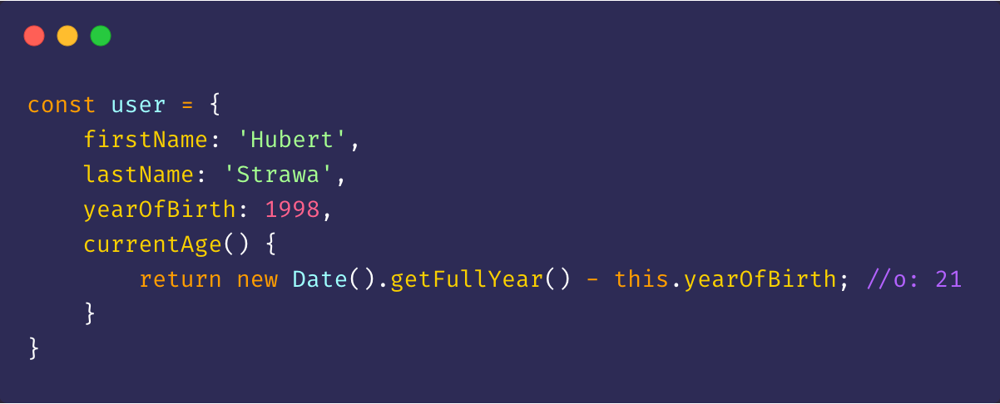
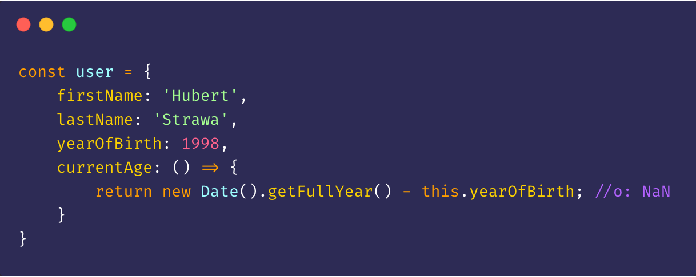
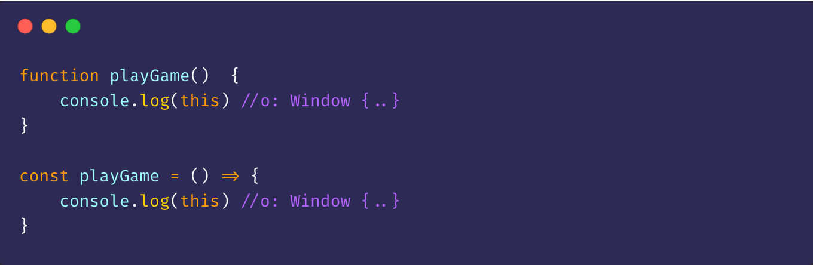
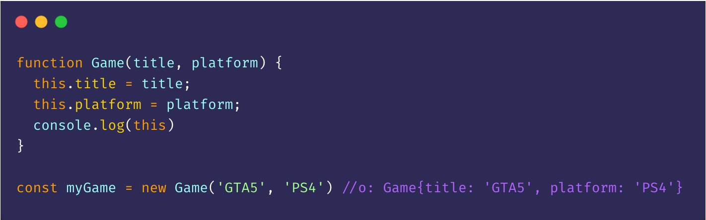

"This" keyword is what confuses a lot of developers. So what is this? Simply speaking 'this' references the object that is executing the current function. There are few rules to it and getting to know them is important, but not really that complicated as you might think it is.

## 'This' and methods - functions as parts of objects ##

As you can see above 'this' is being used in a method and it's why 'this' is pointing to the whole object the method is called on. However the method itself has to be defined using either ES6 Method definitions or simply 'function' keyword. A method defined using an arrow function would not have 'this' value pointing to the object it's located in because arrow functions do not have 'this' binding.

If you were to define a method using an **arrow function** that would end up in 'this' referencing the Window object. So calling a method currentAge on the object from example above would return NaN since it doesn't recognize yearOfBirth key.

## 'This' and regular functions

In case of functions the value of 'this' depends on how the function is called. If your code is not in the strict mode, 'this' points to the global object by default.

### Constructor functions

If you call a function using the 'new' operator (as in the example above) 'this' will reference a newly created object.

<!-- ### Regular functions inside of methods -->
